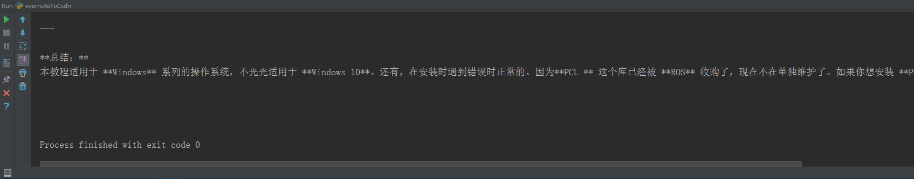
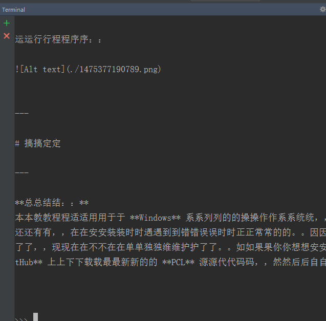
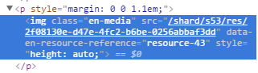
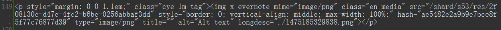
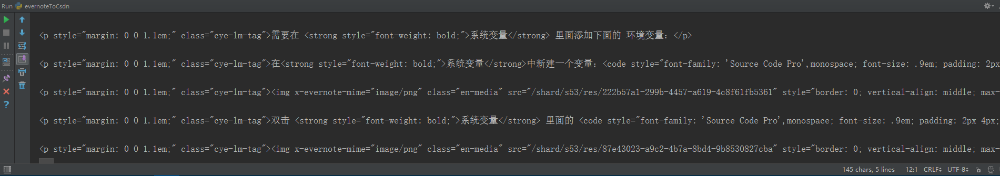
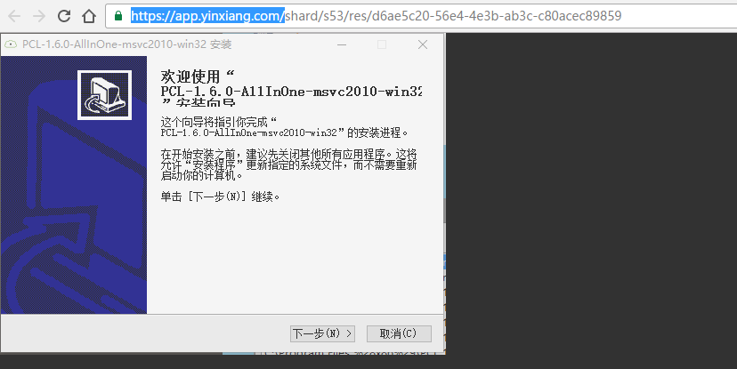
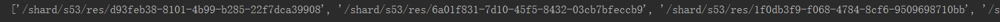
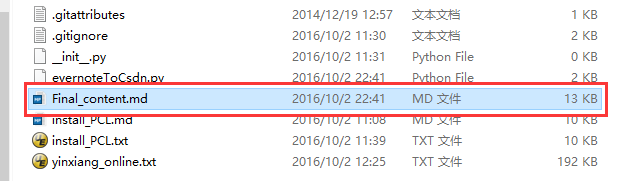

# 编写一个 将 .md 文件转化 CSDN 博客源代码 的Python脚本 --- 目的：为了解决CSDN编写博文是从本地上传图片到CSDN服务器速度慢的问题 --- 结果：这个方法解决不了问题 --- 最终得到的办法：在Github上搭建博客，接着再在CSDN上使用GIthub博客里图片的URL链接 --- 2016年10月2日 星期日


## 编写一个 将 .md 文件转化 CSDN 博客源代码 的Python脚本


我使用的IDE软件： **PyCharm 2016 04**
我使用的Python版本：**Python2.7.10**

工程本地所在路径：**D:\WorkSpace\python_ws\EvernoteToCsdn**
工程名：**EvernoteToCsdn**
工程里面的文件：
**evernoteToCsdn.py** ： 将将 .md 文件里面的内容转化 CSDN 博客源代码
源代码存放在：https://github.com/AoboJaing/EvernoteToCsdn


程序统一在 **PyCharm** 软件中的 **Run** 窗口中运行。


---

## Python 打开一个文本文件

**打开一个 `.md` 文件：**

```python
f = open('D:\WorkSpace\python_ws\EvernoteToCsdn\EvernoteToCsdn\install_PCL.md', 'r')
md = f.read()
f.close()

print md.decode('utf-8')

```

> 注意，在使用 **Pycharm** 软件里面的 **Run** 窗口的时候，在程序中所有需要被调用的文件的所在路径都不需要写绝对路径。如果你写的是相对路径，在 **Run** 窗口中运行脚本就会报错。（在 **Terminal** 窗口中就不会有这样的问题，不管是绝对路径还是相对路径，程序都可以使用。）

运行输出：（在 **Run** 窗口中）



> 但是同样的程序，在 **Terminal** 窗口中运行就是错误的，我也不知道为什么？
> ```
> > C:\Python27\python.exe -i EvernoteToCsdn\evernoteToCsdn.py
> ```
> 
> 
>  
>  先不管这个问题。

---

## Python中的转义字符 使用正则表达式得到 `.md` 文件中  `` 这个样子的字符串中的`xxx` 字符串

因为这个模板： `` 中有 `()` 和 `[]` 这样的字符，虽然它们在Python语言中不是转义字符，但是因为在正则表达式中，这两个字符都是被使用的工具，所以，如何模板字符串中有这样的字符，我们需要在这样的字符前面加上 反斜杠：`\` 。

```python
a = re.findall('!\[Alt text\]\((.*?)\)', md, re.S)
print a
```

运行输出：
```
['./1475185523275.png', './1475185542021.png', './1475291577407.png', './1475291600927.png', './1475185222317.png', ....]
```

> Python 中的转义字符有哪些，请开这个博客：http://www.cnblogs.com/allenblogs/archive/2011/04/28/2031477.html

---


## 读取 在印象笔记里面在线笔记的源代码的txt文件

在 **Chrome** 浏览器中源代码的样子

```
<p style="margin: 0 0 1.1em;"></p>
```


将整个源代码复制到`txt` 文件里面后，这段源代码的样子：

```
<p style="margin: 0 0 1.1em;" class="cye-lm-tag"></p>
```




---

将印象笔记中笔记的在线网页的源代码拷贝到一个txt文件里面，我们在Python程序里读取这个txt文件：

```
f = open('D:\WorkSpace\python_ws\EvernoteToCsdn\EvernoteToCsdn\yinxiang_online.txt', 'r')
yinxiang_html = f.read()
f.close()

print yinxiang_html
```

运行：




---

## 使用正则表达式将 `yinxiang_online.txt` 文件中有用信息提取出来

同一个图片，我们来分析下面的信息：

---

在**Chrome** 浏览器中，印象在线笔记中网页的源代码中，图片的源代码：

```

```

图片网站的URL链接：

```
https://app.yinxiang.com/shard/s53/res/d6ae5c20-56e4-4e3b-ab3c-c80acec89859
```

在`yinxiang_online.txt` 文件：

```
<p style="margin: 0 0 1.1em;" class="cye-lm-tag"></p>
```

在 `install_PCL.md` 文件中：

```

```

---

我们通过观察发现。我们的目的是要得到最终的图片**URL**链接。

我们需要通过在 `yinxiang_online.txt` 文件 里面的信息中生成 最终图片的**URL**链接。最终，我们发现图片完整的**URL**链接为：

完整的图片**URL**链接 = `https://app.yinxiang.com` + `yinxiang_online.txt` 文件里相应图片的`src` 

比如：



---

使用正则表达式将 `yinxiang_online.txt` 文件中有用信息提取出来。代码如下：

```python
image_relative_path = re.findall('<p style="margin: 0 0 1.1em;" class="cye-lm-tag"><img x-evernote-mime="image/png" class="en-media" src="(.*?)"', yinxiang_html, re.S)
print image_relative_path
```

运行：



---

## 将 图片的相对**URL**链接 变成 绝对**URL**链接


```python
if len(a)==len(image_relative_path):
    for i in range(len(image_relative_path)):
        image_relative_path[i] = 'https://app.yinxiang.com' + image_relative_path[i]

print image_relative_path
```


---

## 将`.md` 文件中的 `` 中的`xxx`  **替换** 成对应图片的**URL**绝对链接。

参考网站：http://www.cnblogs.com/wanpython/archive/2010/05/31/1748387.html

```python
if len(image_local_path)==len(image_relative_path):
    for i in range(len(image_relative_path)):
        md = md.replace(image_local_path[i], image_relative_path[i])

print md.decode('utf-8')
```

---

## 将最终得到的 `.md` 文件里面的内容另存为到 `Final_content.md` 文件里面。 

```python
f = open('D:\WorkSpace\python_ws\EvernoteToCsdn\EvernoteToCsdn\Final_content.md', 'w')
f.write(md)
f.close()
```

运行脚本后，得到：




---

现在整个测试代码的功能就都实现了。

---

# 可惜啊，这种方法已经不能使用了

因为：
因为这些图片的URL链接只有我登录了印象笔记的账号，我才能看到。也就是说，这些图片，然后其他用户访问我的网站的话，它们是看不到图片的。


---

所以现在我还是只能继续将博客里面的图片上传到CSDN比较保险，但是CSDN的上传速度实在是太慢了，我该怎么办。难道需要自己买一个服务器吗。


---

## 另开新径

印象笔记属于私人的空间，是需要有用户名和密码才能够访问的，那么如果我们将图片存放在一个公有的空间中，那么在使用这个图片的**URL**链接放置在我的CSDN博客博文里面，不就可以给所有人看了吗。

所有现在的问题是：找到一个可以存放图片的云盘。并将这块区域设置为公有空间。没错，我们就使用**百度云**。

百度云盘，上传速度快。

---

我现在在我的百度云盘里面创建下面的路径：


以后，我们就将图片文件都存放在这里面。

我现在将这个 `img` 文件夹公开分享。
http://pan.baidu.com/s/1eSPtP8e


但是，如果一个分享中超过了1个文件的话，那么这个分享创建的网页就是一个动态网页；如果你只分享一个文件的话，那么这个分享创建出来的网页就是一个静态网页。

对于动态网页我们无法直接得到每个文件正在的**URL**链接。
而对于静态网页，虽然我们可以得到文件真正的**URL**链接，但是如果一个一个文件的上传的话，它的效率其实和将图片上传到CSDN网站是一样的。

---

所以，现在的问题就变成了：如何获取 **百度云** 分享网页里面文件真正的**URL**链接。

但是这个问题，我根本找不到解决办法，我没有办法做到将**百度云** 的资源中获取里面图片资源的URL链接，然后使用在**CSDN**的博文中。


---

## 再次另辟解决路径 --- 打算 使用 博客园 ，不再使用CSDN

**博客园**

优点：
1 . 图片无需上传，可以直接粘贴或退拽就可以将图片放在在正在编辑的博文中，并且速度非常快。
2 . 没有广告
3 . 博客的页面风格多
缺点
1 . 使用MarkDown编写博客的时候没有预览功能
2 . 使用**Markdown**编写的代码段没有行号
3 . 在Baidu搜索上的推广没有CSDN强。

**CSDN**

优点
1 . 使用的人多
2 . 在Baidu搜索上的推广做的好
3 . 有排名功能，可以鼓励博主写博客
4 . 有博客专栏功能
5 . Mardown编写博客有预览的功能
6 . Markdown编写博客有快捷键的功能
7 . Makdown编写博客的代码段有行号
缺点
1 . 广告太多
2 . 写博客的话，上传图片太慢，并且麻烦，图片上传的时候慢得要死，而且还会出现网页崩溃的现象。

---

基本就是这样。其实我内心中的想法还是坚持使用**CSDN**的。但是这个上传图片实在是太慢了。慢得要死，如果这个问题不解决的话，对我的工作效率会产生极大的影响。严重的对我的工作效率拉后腿。

---

我现在只剩下一个唯一的解决办法，就是：使用网络爬虫，让它帮我在后台上传图片。我只能这么做了。

---


## 我突然有想起来一个方法：将博客写到Github Page上啊

对啊，我这么忘记了。这才是完美的做法。这样做的好处是超级的多。

1 . 我可以将将我的博客写成一个自己的网络站点，
2 . 并且可以解决上传（图片）问题
3 . Github有版本管理的功能，我还可以才看我的网页编译时修改的痕迹
4 . 我写的就是技术类的博客，也就是说：博文和程序代码可以联系到一起。

而且，我现在有 **Github For Windows** 的GUI界面软件，上传和更新网页的速度都非常的快，并且是GUI界面，操作也是非常的简单，我可以全心投入到写博客上，而不需要去管其他的事情。（管理博客的事情就交个**Github**去做，我字只需要编写博客。）


---

所以，现在我需要知道一点：

**Q：** **Github ** 是否有对用户的存储空间有限制？

**A：**  这个问题你是多虑了，**GitHub ** 对所有的用户都是没有存储空间上限的，你有无限的存储空间。也就是说：你可以在**Github Page**上面写无数的博文。如果你还是不相信这幸福来得太突然，你可以查看**GitHub Help**里面的[这篇文章](https://help.github.com/articles/what-is-my-disk-quota/)。

---

所以，我现在就也这样做：
现在，在**GitHub** 上搭建博客。然后将博客都写到**Github** 上，接着，我可以将**Github** 上的博客，转移到**CSDN**博客上，这样我就不需要将**图片**上传到**CSDN**服务器上了，而是上传到我的**GIthub**用户的空间上，然后在**CSDN**博客里面使用使用**Github**博客里面的图片的**URL**链接。
完美。


